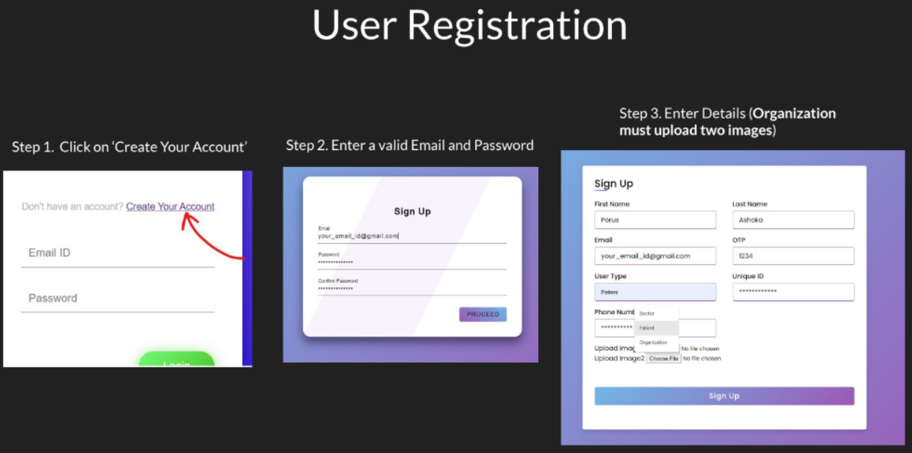
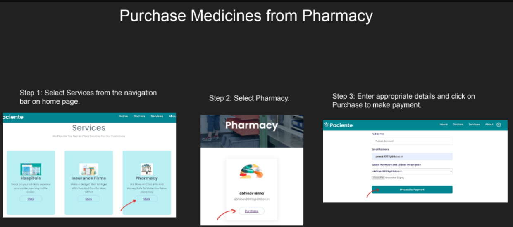
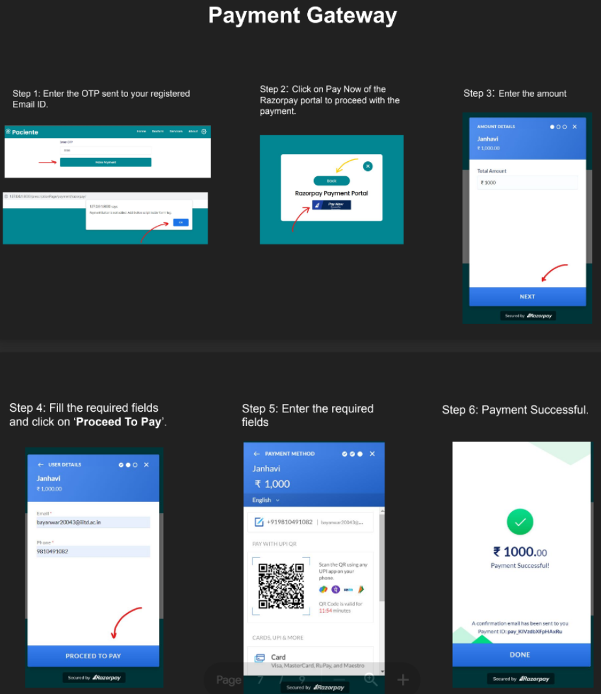

> Paciente is a highly secure **Django**-based website developed specifically for the **IIITD's Intranet**. It offers a seamless online experience for appointments, prescriptions, and transactions while offering robust cyber security measures.<br/>

### :lock: Cyber Security Features 

* **SSL** used for hosting the website (within IIITD's intranet at https://192.168.3.114) <br/>
* **Two-Factor Authentication** during Sign-Up and RazorPay transactions via OTP <br/>
* **SHA256** password encryption <br/>
* Secure against **_SQL Injection_** attacks <br/>
* Protected from **_XSS_** and **_CSRF_** attacks <br/>
* Server capable of restarting against **_DOS_** attacks using **_Slowloris_** <br/>
* Input validation and sanitization <br/>
* Strong **password validation** <br/><br/>







<h2> Tech Stack </h2>

- Front-End Development: **_HTML, CSS, JavaScript_** <br/>
- Back-End Framework   : **_Django (Python)_** <br/>
- Database             : **_SQLite_** <br/>
- Server               : **_Nginx_** <br/>
- Payment Gateway      : **_RazorPay_** <br/><br/>


[YouTube Video Link](https://youtu.be/JNq6Itf5ro0) <br/>
[User Guide](https://drive.google.com/file/d/1Lc8HBtGRO4rg8CY4wmITUvYwkNMEJncB/view?usp=share_link) <br/>
[Demo Transaction Receipt recieved over Email](https://drive.google.com/file/d/1-XOXT0Pif_a26axTZCCtbZv1GAOD6s74/view?usp=share_link) <br/><br/>

**Useful Commands for Installing Libraries**: <br/>
```lex
sudo apt install python-django
pip install python-decouple
pip install django-admin-honeypot
```

**Other Commands useful while testing the Application**: <br/>
```lex
python manage.py runserver
python manage.py showmigrations
python manage.py makemigrations
python manage.py migrate
```

### :busts_in_silhouette: Other Contributors:
- [Abhinav Kumar Sinha](https://github.com/abhinav20012)
- [Janhavi Bayanwar](https://github.com/Janhavi2002)
- [Vineet Kaul](https://github.com/VineetVK09)
